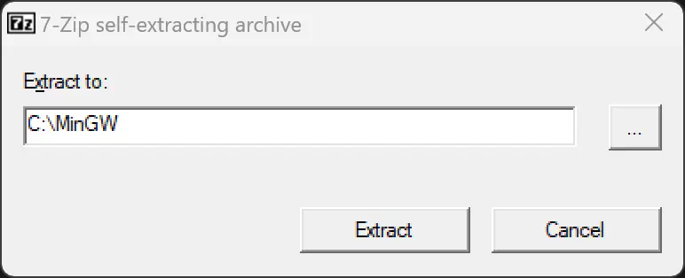

**MinGW** is a native Windows port of the GNU Compiler Collection (GCC), with freely distributable import libraries and
header files that are used for building native Windows applications, building libraries.

The **CMake** software is a free, cross-platform, open-source tool that automates build processes, tests, packages, and
installs software using a compiler-independent architecture.

**MSYS** is a collection of tools and libraries providing you with an easy-to-use environment for building, installing
and
running native Windows software.

There are many advantages to having a portable Python version over installing one:

- It is easy to delete if you no longer need it. Just delete the folder.
- There are no changes made to the system files, registry, or environment variables.
- It is easy to use on any PC, just copy it to a Pen drive and you’re good to go.

The easiest way to install it is using the link below. The installer on the link contains MinGW with GCC extra libraries
that are commonly used (like boost, make) in one single exe file, but it does not contain CMake and MSYS, so we will add
those later.

## Setting up MinGW (GCC) compiler

Download the latest available [MinGW](https://nuwen.net/mingw.html) exe file

The current latest version exe file is `mingw-18.0.exe`

Download and open the exe file (which is basically a zip file). It will ask you for a location to extract the file. Once
you specify a path and click on extract it will extract all the files in that location.

After extracting there will be two batch files inside the folder. That will be helpful in setting up the path in the
command prompt (CMD).

There are two ways to set up the path, first is open the command prompt and run the set_distro_paths.bat file and the
second option is by directly clicking on the open_distro_window.bat file which will directly open the command prompt
with all the correct paths set up already.

## Setting up CMake

Download the latest CMake zip file (Windows x64 ZIP) from the official link https://cmake.org/download/
The current latest version exe file is cmake-3.24.1-windows-x86_64.zip
After downloading the zip file extract all the files into a temporary directory. Create an empty folder named cmake in
the MinGW folder that we previously created then copy all the files from inside the extracted folder to the cmake folder
we created in the MinGW folder. As shown in the image below.
The content inside the cmake folder is shown in the below image.

## Update the batch file

After setting up CMake, now we will have to update the set_distro_paths.bat file so it knows where to find the CMake
files. Open the batch file in a text editor and replace the line set PATH=%~dp0bin;%PATH% with set PATH=%~dp0bin;%~
dp0cmake\bin;%PATH% then save the file.
This is all you need to do to install and set up MinGW (GCC compiler) with CMake.